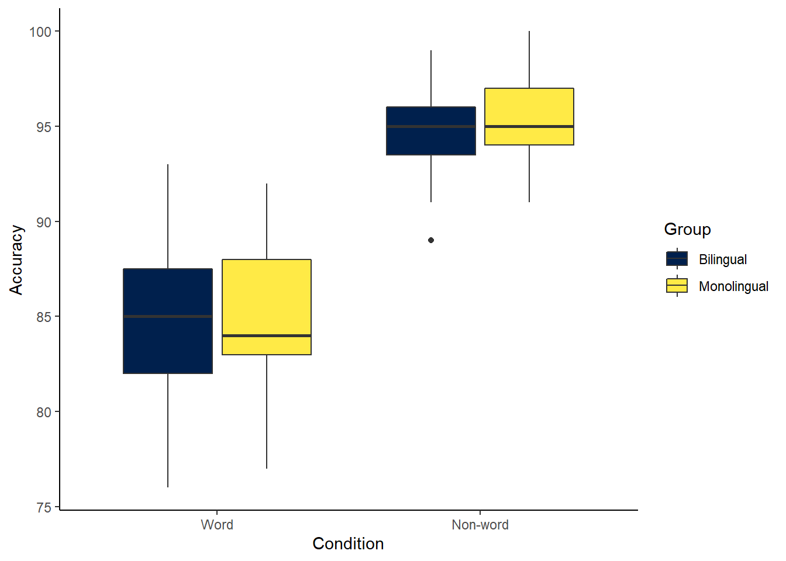
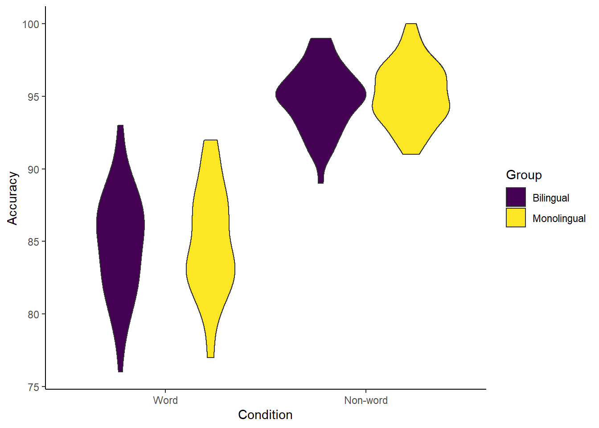
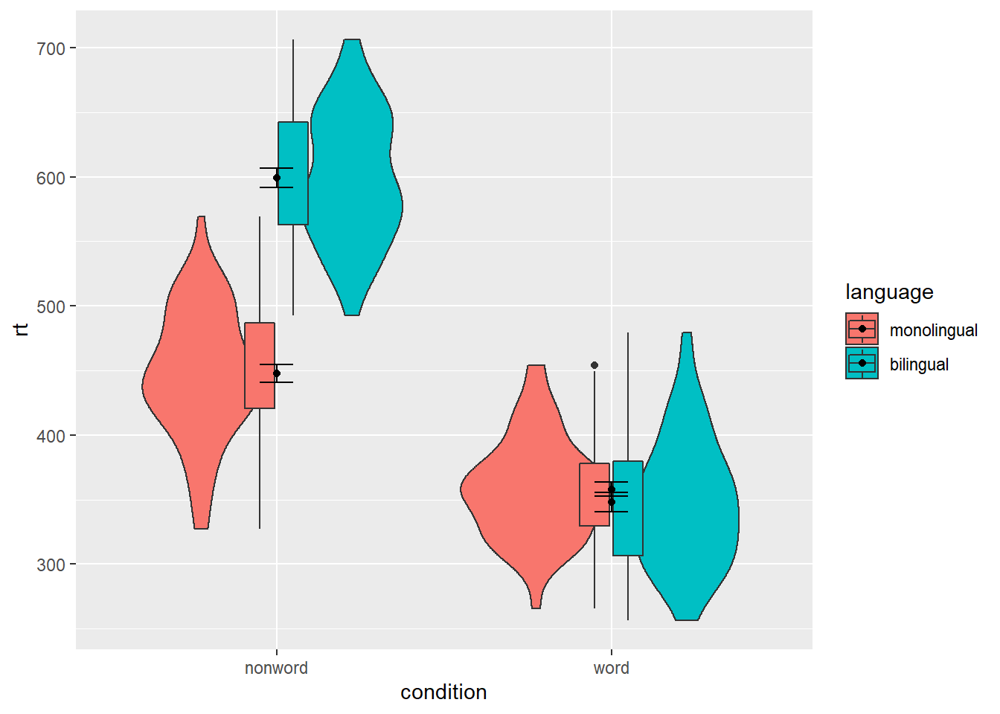
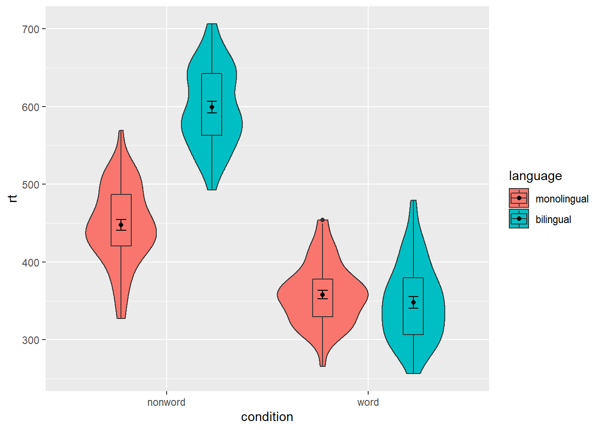
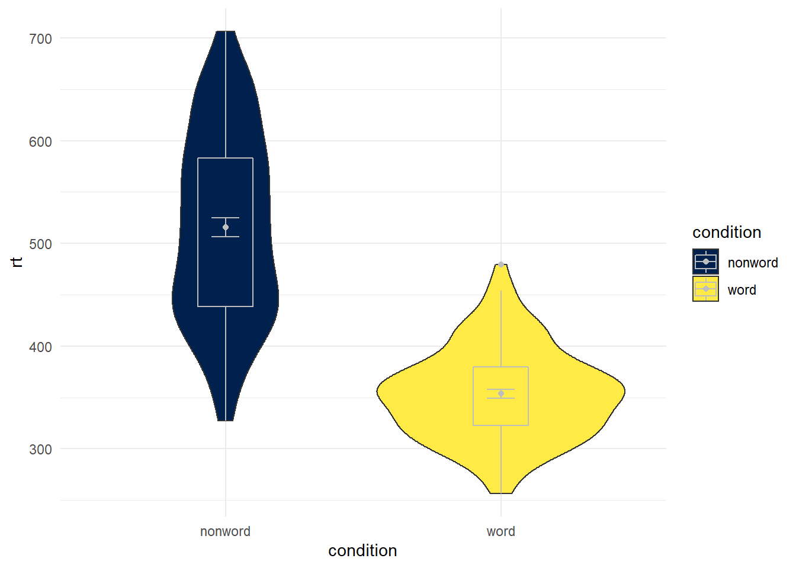
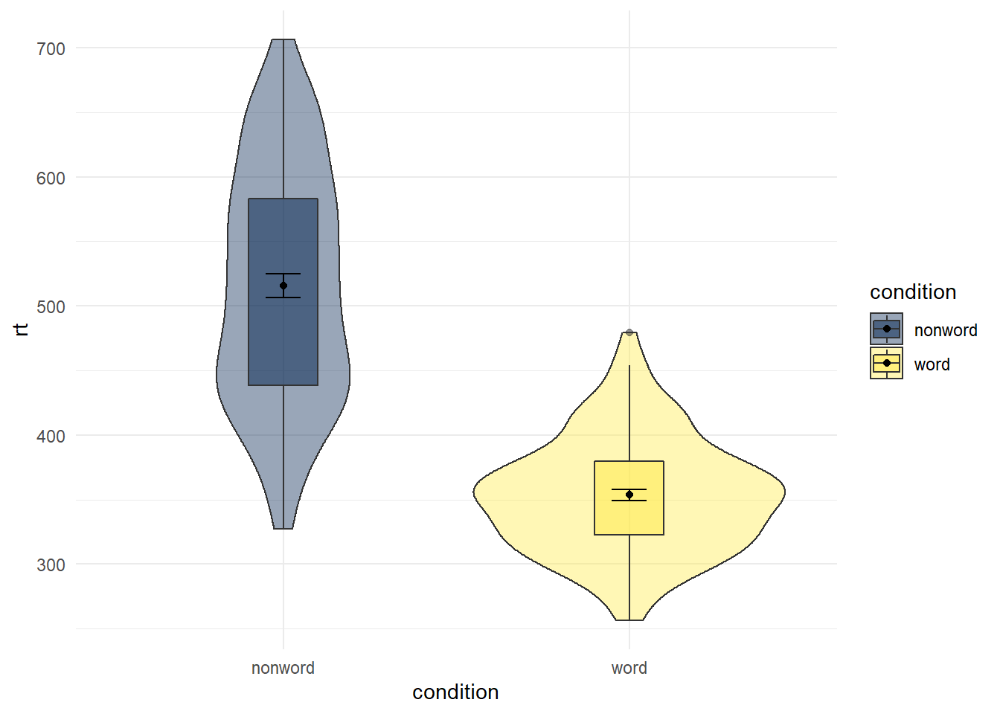

# Chapter 4

## Boxplots

As with `geom_point()`, boxplots also require an x and y-variable to be specified. In this case, `x` must be a discrete, or categorical variable, whilst `y` must be continuous.


```r
ggplot(dat_long, aes(x = condition, y = acc)) +
  geom_boxplot()
```

<div class="figure" style="text-align: center">

<p class="caption">(\#fig:boxplot1)Basic boxplot.</p>
</div>

### Grouped boxplots

As with histograms and density plots, `fill` can be used to create grouped boxplots:


```r
ggplot(dat_long, aes(x = condition, y = acc, fill = language)) +
  geom_boxplot() +
  scale_fill_viridis_d(option = "D",
                       name = "Group",
                       labels = c("Bilingual", "Monolingual")) +
  theme_classic() +
  scale_x_discrete(name = "Condition",
                   labels = c("Congruent", "Incongruent")) +
  scale_y_continuous(name = "Accuracy")
```

<div class="figure" style="text-align: center">

<p class="caption">(\#fig:boxplot2)Grouped boxplots</p>
</div>

## Violin plots

Violin plots display the distribution of a dataset and can be created by calling `geom_violin()`. They are so-called because the shape they make sometimes looks something like a violin. They are essentially a mirrored density plot on its side. Note that the below code is identical to the code used to draw the boxplots above, except for the call to `geom_violin()` rather than `geom_boxplot().`


```r
ggplot(dat_long, aes(x = condition, y = acc, fill = language)) +
  geom_violin() +
  scale_fill_viridis_d(option = "D",
                       name = "Group",
                       labels = c("Bilingual", "Monolingual")) +
  theme_classic() +
  scale_x_discrete(name = "Condition",
                   labels = c("Congruent", "Incongruent")) +
  scale_y_continuous(name = "Accuracy")
```

<div class="figure" style="text-align: center">

<p class="caption">(\#fig:violin1)Violin plot.</p>
</div>

## Bar chart of means

Commonly, rather than visualising distributions of raw data researchers will wish to visualise the mean using a bar chart with error bars. Although this is one of the most common data visualisations, it is somewhat unintuitive for novice learners of R to achieve in `ggplot`. We present this code here because it is a common visualisation, however, we would urge you to use a better visualisation that provides more transparency about the distribution of the raw data such as the violin-boxplots we will present in the next section.

Rather than calling a `geom_` function, we call `stat_summary()`.

-   `fun` specifies the summary function that gives us the y-value we want to plot, in this case, `mean`

-   `geom` specifies what shape or plot we want to use to display the summary. For the first layer we will specify `bar`.


```r
ggplot(dat_long, aes(x = condition, y = rt)) +
  stat_summary(fun = "mean", geom = "bar")
```

<div class="figure" style="text-align: center">

<p class="caption">(\#fig:badbar1)Bar plot of means.</p>
</div>

To add the error bars, another layer is added with a second call to `stat_summary`. This time, the function represents the type of error bars we wish to draw, you can choose from `mean_se` for standard error, `mean_cl_normal` for confidence intervals, or `mean_sdl` for standard deviation. `width` controls the width of the error bars - try changing the value to see what happens.

-   Whilst `fun` returns a single value (y), `fun.data` returns the y-values we want to plot plus their minimum and maximum values, in this case, `mean_se`


```r
ggplot(dat_long, aes(x = condition, y = rt)) +
  stat_summary(fun = "mean", geom = "bar") +
  stat_summary(fun.data = "mean_se", geom = "errorbar", width = .2)
```

<div class="figure" style="text-align: center">

<p class="caption">(\#fig:badbar2)Bar plot of means with error bars representing SE.</p>
</div>

## Violin-boxplot

The power of the layered system is further highlighted by the ability to combine different types of plots. For example, rather than using a bar chart with error bars, one can easily create a single plot that includes a violin plot, boxplot, and the mean with error bars. This plot requires just two extra lines of code to produce than the bar plot with error bars, yet the amount of information displayed is vastly superior.

* `fatten = NULL` removes the median line from the boxplot, which can make it easier to see the mean and error bars. Including this argument will result in the warning message `Removed 1 rows containing missing values (geom_segment)` and is not a cause for concern. Removing this argument will reinstate the median line. 


```r
ggplot(dat_long, aes(x = condition, y= rt)) +
  geom_violin() +
  # remove the median line with fatten = NULL
  geom_boxplot(width = .2, fatten = NULL) +
  stat_summary(fun = "mean", geom = "point") +
  stat_summary(fun.data = "mean_se", geom = "errorbar", width = .1)
```

<div class="figure" style="text-align: center">

<p class="caption">(\#fig:viobox1)Violin-boxplot with mean dot and standard error bars.</p>
</div>

It is important to note that the order of the layers matters. For example, if we call `geom_boxplot()` followed by `geom_violin()`, we get the following mess:


```r
ggplot(dat_long, aes(x = condition, y= rt)) +
  geom_boxplot() +  
  geom_violin() +
  stat_summary(fun = "mean", geom = "point") +
  stat_summary(fun.data = "mean_se", geom = "errorbar", width = .1)
```

<div class="figure" style="text-align: center">

<p class="caption">(\#fig:viobox1b)Plot with the geoms in the wrong order.</p>
</div>

### Grouped violin-boxplots

As with previous plots, another variable can be mapped to `fill` for the violin-boxplot, however, simply adding `fill` to the mapping causes the different components of the plot to become misaligned because they have different default positions:


```r
ggplot(dat_long, aes(x = condition, y= rt, fill = language)) +
  geom_violin() +
  geom_boxplot(width = .2, fatten = NULL) +
  stat_summary(fun = "mean", geom = "point") +
  stat_summary(fun.data = "mean_se", geom = "errorbar", width = .1)
```

<div class="figure" style="text-align: center">

<p class="caption">(\#fig:viobox2)Grouped violin-boxplots without repositioning.</p>
</div>

To rectify this we need to adjust the argument `position` for each of the misaligned layers. `position_dodge()` instructs R to move (dodge) the position of the plot component by the specified value - what value you need can sometimes take trial and error.


```r
ggplot(dat_long, aes(x = condition, y= rt, fill = language)) +
  geom_violin() +
  geom_boxplot(width = .2, fatten = NULL, position = position_dodge(.9)) +
  stat_summary(fun = "mean", geom = "point", 
               position = position_dodge(.9)) +
  stat_summary(fun.data = "mean_se", geom = "errorbar", width = .1,
               position = position_dodge(.9))
```

<div class="figure" style="text-align: center">

<p class="caption">(\#fig:viobox3)Grouped violin-boxplots with repositioning.</p>
</div>

## Customisation part 3

Combining multiple type of plots can present an issue with the colours, particularly when the viridis scheme is used - in the below example it is hard to make out the black lines of the boxplot and the mean/errorbars.


```r
ggplot(dat_long, aes(x = condition, y= rt, fill = language)) +
  geom_violin() +
  geom_boxplot(width = .2, fatten = NULL, position = position_dodge(.9)) +
  stat_summary(fun = "mean", geom = "point", 
               position = position_dodge(.9)) +
  stat_summary(fun.data = "mean_se", geom = "errorbar", width = .1,
               position = position_dodge(.9)) +
  scale_fill_viridis_d(option = "E") +
  theme_minimal()
```

<div class="figure" style="text-align: center">

<p class="caption">(\#fig:viobox4)A color scheme that makes lines difficult to see.</p>
</div>

There are a number of solutions to this problem. First, we can change the colour of individual geoms by adding `colour = "colour"` to each relevant geom:


```r
ggplot(dat_long, aes(x = condition, y= rt, fill = condition)) +
  geom_violin() +
  geom_boxplot(width = .2, fatten = NULL, colour = "grey") +
  stat_summary(fun = "mean", geom = "point", colour = "grey") +
  stat_summary(fun.data = "mean_se", geom = "errorbar", width = .1, colour = "grey") +
  scale_fill_viridis_d(option = "E") +
  theme_minimal()
```

<div class="figure" style="text-align: center">

<p class="caption">(\#fig:viobox5)Manually changing the line colors.</p>
</div>

We can also keep the original colours but adjust the transparency of each layer using `alpha`. Again, the exact values needed can take trial and error:


```r
ggplot(dat_long, aes(x = condition, y= rt, fill = condition)) +
  geom_violin(alpha = .4) +
  geom_boxplot(width = .2, fatten = NULL, alpha = .5) +
  stat_summary(fun = "mean", geom = "point") +
  stat_summary(fun.data = "mean_se", geom = "errorbar", width = .1) +
  scale_fill_viridis_d(option = "E") +
  theme_minimal()
```

<div class="figure" style="text-align: center">

<p class="caption">(\#fig:viobox6)Using transparency on the fill color.</p>
</div>

## Activities 3

Before you go on, do the following:

-   Review all the code you have run so far. Try to identify the commonalities between each plot's code and the bits of the code you might change if you were using a different dataset.

-   Take a moment to recognise the complexity of the code you are now able to read.

-   For the violin-boxplot, for `geom = "point"`, try changing `fun` to `median`


<div class='solution'><button>Solution</button>


```r
ggplot(dat_long, aes(x = condition, y= rt)) +
  geom_violin() +
  # remove the median line with fatten = NULL
  geom_boxplot(width = .2, fatten = NULL) +
  stat_summary(fun = "median", geom = "point") +
  stat_summary(fun.data = "mean_se", geom = "errorbar", width = .1)
```

</div>


-   For the violin-boxplot, for `geom = "errorbar"`, try changing `fun.data` to `mean_cl_normal` (for 95% CI)


<div class='solution'><button>Solution</button>


```r
ggplot(dat_long, aes(x = condition, y= rt)) +
  geom_violin() +
  # remove the median line with fatten = NULL
  geom_boxplot(width = .2, fatten = NULL) +
  stat_summary(fun = "mean", geom = "point") +
  stat_summary(fun.data = "mean_cl_normal", geom = "errorbar", width = .1)
```

</div>


-   Go back to the grouped density plots and try changing the transparency with `alpha`.


<div class='solution'><button>Solution</button>


```r
ggplot(dat_long, aes(x = rt, fill = condition)) +
  geom_density(alpha = .4)+
  scale_x_continuous(name = "Reaction time (ms)") +
  scale_fill_discrete(name = "Condition",
                      labels = c("Congruent", "Incongruent"))
```

</div>


