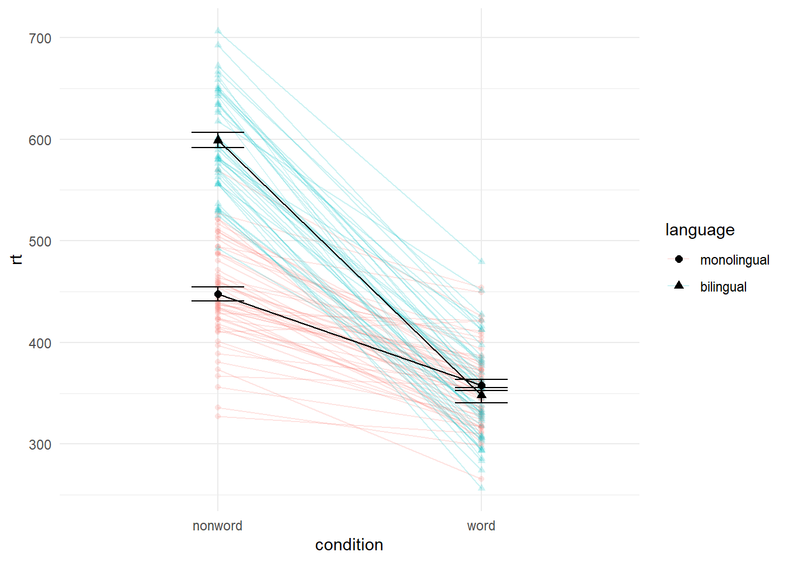

# Chapter 5

## Interaction plots

Interaction plots are commonly used to help display or interpret a factorial design. Just like with the bar chart of means, interaction plots represent data summaries and so they are built up with a series of calls to `stat_summary()`.

-   `shape` acts much like `fill` in previous plots, except that rather than producing different colour fills for each level of the IV, the data points are given different shapes.

-   `size` lets you change the size of lines and points. You usually don't want different groups to be different sizes, so this option is set inside the relevant `geom_*()` function, not inside the `aes()` function.

-   `scale_color_manual()` works much like `scale_color_discrete()` except that it lets you specify the colour values manually.

I DON'T KNOW WHY THIS CODE ISN'T LETTING ME ADJUST THE VIRIDIS color OPTION, WHEN I CHANGE IT NOTHING HAPPENS
LISA - it changes for me, but this might be a place to introduce scale_color_manual() ?


```r
ggplot(dat_long, aes(x = condition, y = rt, 
                     shape = language,
                     group = language,
                     color = language)) +
  stat_summary(fun = "mean", geom = "point", size = 3) +
  stat_summary(fun = "mean", geom = "line") +
  stat_summary(fun.data = "mean_se", geom = "errorbar", width = .2) +
  scale_color_manual(values = c("blue", "darkorange")) +
  theme_classic()
```

<div class="figure" style="text-align: center">

<p class="caption">(\#fig:ixn-plot)Interaction plot.</p>
</div>

`ggplot` will scale the axis start and end points to the data. If you wish to adjust these, you can use the `scale_` functions, for example, the below code specifies the `limits` (start and end points) of the y-axis should be 0 - 750 ms.


```r
ggplot(dat_long, aes(x = condition, y = rt, 
                     group = language,
                     color = language)) +
  stat_summary(fun = "mean", geom = "point") +
  stat_summary(fun = "mean", geom = "line") +
  stat_summary(fun.data = "mean_se", geom = "errorbar", width = .2) +
  scale_color_manual(values = c("blue", "darkorange")) +
  theme_classic() +
  scale_y_continuous(limits = c(0, 750))
```

<div class="figure" style="text-align: center">

<p class="caption">(\#fig:unnamed-chunk-2)**CAPTION THIS FIGURE!!**</p>
</div>

-   Raincloud plots
-   Heatmaps
-   Saving plots
-   Facets with scatterplot - 
-   p + notation explain what it means, use of layers
- Getting rid of legends

ridge
Alluvial
raincloud
split-violin
