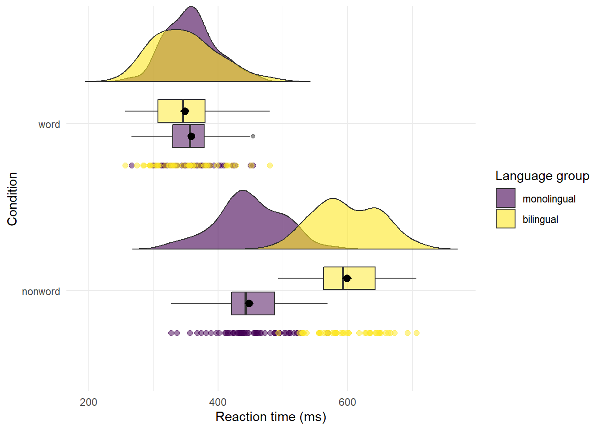

# Chapter 6

This tutorial has but scratched the surface of the visualisation options available using R - in the additional online resources we provide some further advanced plots and customisation options for those readers who are feeling confident with the content covered in this tutorial, however, the below plots give an idea of what is possible, and represent the favourite plots of the authorship team.

### Split-violin plots

Split-violin plots remove the redundancy of mirrored violin plots and make it easier to compare the distributions between multiple conditions.

(\#fig:unnamed-chunk-4)**CAPTION THIS**

### Raincloud plots

LISA CAN YOU MAKE MY RAINCLOUD PLOTS LOOKS A BIT BETTER, I CAN'T FIGURE OUT HOW TO JITTER THE RAIN

Raincloud plots combine a density plot, boxplot, raw data points, and any desired summary statistics for a complete visualisation of the data. They are so called because the density plot + raw data is reminiscent of a rain cloud.

(\#fig:unnamed-chunk-5)**CAPTION THIS**

### Ridge plots

Ridge plots are a series of density plots and show the distribution of numeric values for several groups. Figure X is by [@Nation2017] and demonstrates how effective this type of visualisation can be to convey a lot of information very intuitively whilst being visually attractive.

LISA I DON'T KNOW HOW TO GIVE THIS A CAPTION AND A FIGURE NUMBER BECAUSE IT'S NOT IN A CODE CHUNK.

### Alluvial plots

Alluvial plots visualise multi-level categorical data through flows that can easily be traced in the diagram.

In this tutorial we aimed to provide a practical introduction to common data visualisation techniques using R. Whilst a number of the plots produced in this tutorial can be created in point-and-click software, the underlying skill-set developed by making these visualisations is as powerful as it is extendable. we hope that this tutorial serves as a jumping off point to encourage more researchers to adopt reproducible workflows and open-access software, in addition to beautiful data visualisations.
