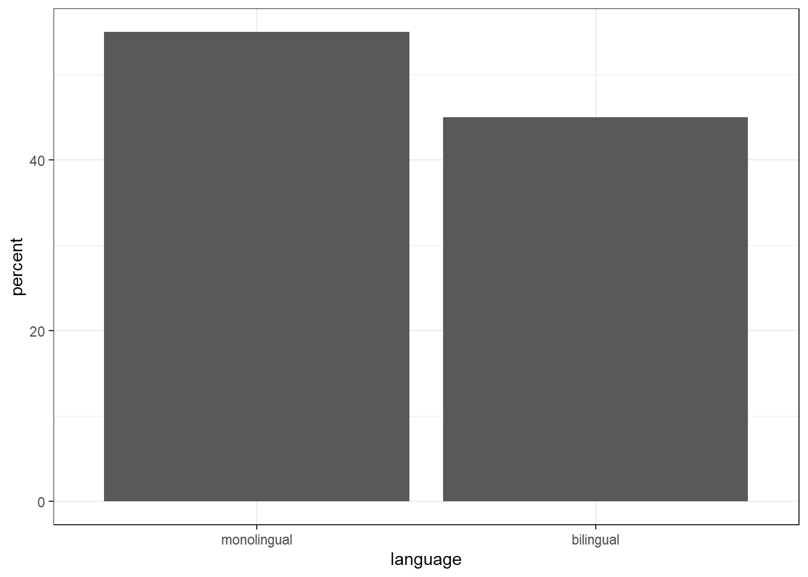
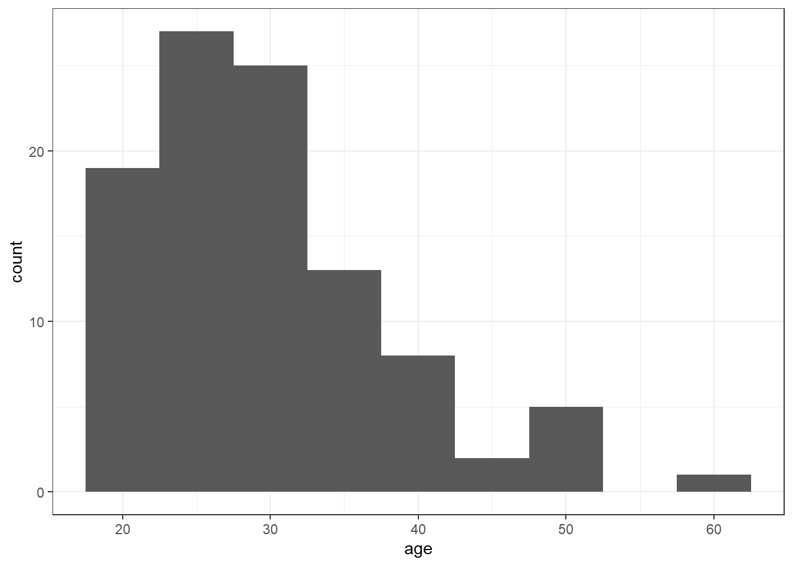
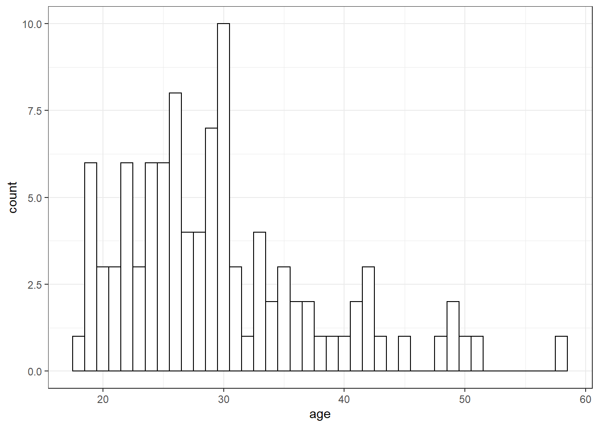

# R Markdown

This is an R Markdown document. Markdown is a simple formatting syntax for authoring HTML, PDF, and MS Word documents. For more details on using R Markdown see <http://rmarkdown.rstudio.com>.

When you click the **Knit** button a document will be generated that includes both content as well as the output of any embedded R code chunks within the document. 

## Tutorial workbook

This workbook contains the code from the tutorial paper. You can add notes to this file and/or make a duplicate copy to work with your own dataset.

The document outline tool will help you navigate this workbook more easily (Ctrl+Shift+O on Windows, Cmd+Shift+O on Mac).

When you are working in a Markdown document, the working directory (where R looks for data files to import, and where it will save any output you create) will default to the folder that the .Rmd file is stored in when you open RStudio by opening the Markdown document. For this reason, make sure that the .Rmd file and the data file are in the same folder before you begin. 

## Chapter 2

### Loading packages

Remember that you need to install the packages before you can load them - but never save the install code in your Markdown.


```r
library(tidyverse)
library(patchwork)
```

### Loading data


```r
dat <- read_csv(file = "ldt_data.csv")
```

```
## 
## -- Column specification --------------------------------------------------------
## cols(
##   id = col_character(),
##   age = col_double(),
##   language = col_double(),
##   rt_word = col_double(),
##   rt_nonword = col_double(),
##   acc_word = col_double(),
##   acc_nonword = col_double()
## )
```

### Handling numeric factors


```r
summary(dat)
str(dat)        
```

```
##       id                 age           language       rt_word     
##  Length:100         Min.   :18.00   Min.   :1.00   Min.   :256.3  
##  Class :character   1st Qu.:24.00   1st Qu.:1.00   1st Qu.:322.6  
##  Mode  :character   Median :28.50   Median :1.00   Median :353.8  
##                     Mean   :29.75   Mean   :1.45   Mean   :353.6  
##                     3rd Qu.:33.25   3rd Qu.:2.00   3rd Qu.:379.5  
##                     Max.   :58.00   Max.   :2.00   Max.   :479.6  
##    rt_nonword       acc_word       acc_nonword   
##  Min.   :327.3   Min.   : 89.00   Min.   :76.00  
##  1st Qu.:438.8   1st Qu.: 94.00   1st Qu.:82.75  
##  Median :510.6   Median : 95.00   Median :85.00  
##  Mean   :515.8   Mean   : 95.01   Mean   :84.90  
##  3rd Qu.:582.9   3rd Qu.: 96.25   3rd Qu.:88.00  
##  Max.   :706.2   Max.   :100.00   Max.   :93.00  
## spec_tbl_df[,7] [100 x 7] (S3: spec_tbl_df/tbl_df/tbl/data.frame)
##  $ id         : chr [1:100] "S001" "S002" "S003" "S004" ...
##  $ age        : num [1:100] 22 33 23 28 26 29 20 30 26 22 ...
##  $ language   : num [1:100] 1 1 1 1 1 1 1 1 1 1 ...
##  $ rt_word    : num [1:100] 379 312 405 298 316 ...
##  $ rt_nonword : num [1:100] 517 435 459 336 401 ...
##  $ acc_word   : num [1:100] 99 94 96 92 91 96 95 91 94 94 ...
##  $ acc_nonword: num [1:100] 90 82 87 76 83 78 86 80 86 88 ...
##  - attr(*, "spec")=
##   .. cols(
##   ..   id = col_character(),
##   ..   age = col_double(),
##   ..   language = col_double(),
##   ..   rt_word = col_double(),
##   ..   rt_nonword = col_double(),
##   ..   acc_word = col_double(),
##   ..   acc_nonword = col_double()
##   .. )
```


```r
dat <- dat %>%
  mutate(language = factor(
    x = language, # column to translate
    levels = c(1, 2), # values of the original data in preferred order
    labels = c("monolingual", "bilingual") # labels for display
  ))
```

### Demographic information


```r
dat %>%
  group_by(language) %>%
  count()
```

```
## # A tibble: 2 x 2
## # Groups:   language [2]
##   language        n
##   <fct>       <int>
## 1 monolingual    55
## 2 bilingual      45
```


```r
dat %>%
  count()
```

```
## # A tibble: 1 x 1
##       n
##   <int>
## 1   100
```


```r
dat %>%
  summarise(mean_age = mean(age),
            sd_age = sd(age),
            n_values = n())
```

```
## # A tibble: 1 x 3
##   mean_age sd_age n_values
##      <dbl>  <dbl>    <int>
## 1     29.8   8.28      100
```


```r
age_stats <- dat %>%
  summarise(mean_age = mean(age),
            sd_age = sd(age),
            n_values = n())
```


```r
dat %>%
  group_by(language) %>%
  summarise(mean_age = mean(age),
            sd_age = sd(age),
            n_values = n())
```

```
## # A tibble: 2 x 4
##   language    mean_age sd_age n_values
##   <fct>          <dbl>  <dbl>    <int>
## 1 monolingual     28.0   6.78       55
## 2 bilingual       31.9   9.44       45
```

### Bar chart of counts


```r
ggplot(data = dat, mapping = aes(x = language)) +
  geom_bar()
```

<div class="figure" style="text-align: center">

<p class="caption">(\#fig:unnamed-chunk-10)Bar chart of counts.</p>
</div>


```r
dat_percent <- dat %>%
  group_by(language) %>%
  count() %>%
  ungroup() %>%
  mutate(percent = (n/sum(n)*100))

ggplot(dat_percent, aes(x = language, y = percent)) +
  geom_bar(stat="identity") 
```

<div class="figure" style="text-align: center">

<p class="caption">(\#fig:unnamed-chunk-11)Bar chart of pre-calculated counts.</p>
</div>


### Histogram


```r
ggplot(dat, aes(x = age)) +
  geom_histogram()
```

```
## `stat_bin()` using `bins = 30`. Pick better value with `binwidth`.
```

<div class="figure" style="text-align: center">

<p class="caption">(\#fig:unnamed-chunk-12)Histogram of ages.</p>
</div>


```r
ggplot(dat, aes(x = age)) +
  geom_histogram(binwidth = 5)
```

<div class="figure" style="text-align: center">

<p class="caption">(\#fig:unnamed-chunk-13)Histogram of ages where each bin covers one year.</p>
</div>

### Customisation 1

#### Changing colours


```r
ggplot(dat, aes(age)) +
  geom_histogram(binwidth = 1, 
                 fill = "white", 
                 colour = "black")
```

<div class="figure" style="text-align: center">

<p class="caption">(\#fig:unnamed-chunk-14)Histogram with custom colors for bar fill and line colors.</p>
</div>

#### Editing axis names and labels


```r
ggplot(dat, aes(language)) +
  geom_bar() +
  scale_x_discrete(name = "Language group", 
                   labels = c("Monolingual", "Bilingual")) +
  scale_y_continuous(name = "Number of participants",
                     breaks = c(0,10,20,30,40,50))
```

<div class="figure" style="text-align: center">

<p class="caption">(\#fig:unnamed-chunk-15)Bar chart with custom axis labels.</p>
</div>


#### Discrete vs continuous errors


```r
ggplot(dat, aes(language)) +
  geom_bar() +
  scale_x_continuous(name = "Language group", 
                   labels = c("Monolingual", "Bilingual")) 
```

#### Adding a theme


```r
ggplot(dat, aes(age)) +
  geom_histogram(binwidth = 1, fill = "wheat", color = "black") +
  scale_x_continuous(name = "Participant age (years)") +
  theme_minimal()
```

<div class="figure" style="text-align: center">

<p class="caption">(\#fig:unnamed-chunk-17)Histogram with a custom theme.</p>
</div>


```r
theme_set(theme_minimal())
```

